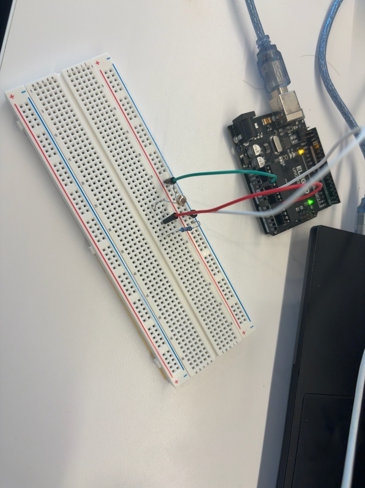

# Arduino Photoresistor Sensor Test

## Project Goal

The goal of this mini-project was to learn how to read real sensor data using an Arduino and understand how the values change based on the environment. This is part of my larger goal of building embedded systems experience for future drone and hardware/software projects.

## What I Built

I connected a photoresistor sensor to an Elegoo UNO R3 board using a breadboard and jumper wires. The Arduino reads the light level using analog pin A0 and prints the sensor value to the Serial Monitor.

The values were around 1010–1030 when the sensor was exposed to bright light. When the light level changed, the analog readings changed as well.

## Circuit Setup

## Files in This Repository

* `photoresistor_test.ino` — Arduino code that reads the photoresistor value from A0.
* `SensorReadingAnalyzer.java` — Java program that takes sensor readings, calculates the average, minimum, and maximum, and classifies the environment as Dark, Medium Light, or Bright.
* `photoresistor_circuit.jpg` — picture of the physical circuit setup.

## What I Learned

* How to use an Arduino analog input pin.
* How to read values from a photoresistor.
* How to view sensor readings using the Serial Monitor.
* How sensor values can be stored and analyzed using Java.
* How to document a small hardware/software project on GitHub.

## Next Steps

* Test the photoresistor in darker and brighter environments.
* Record more sensor readings.
* Improve the circuit documentation with a wiring diagram.
* Use Java or C++ to analyze sensor data more deeply.
* Connect this sensor-reading knowledge to the larger drone project.
